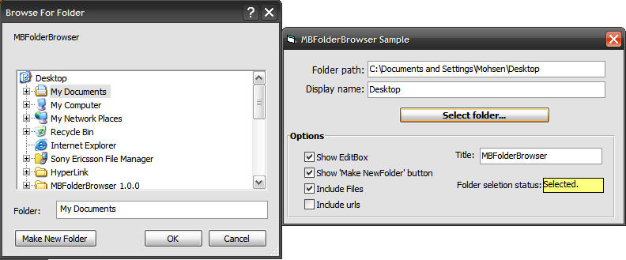



## MBFolderBrowser 1\.0\.0

### Description

a control like common dialog but this control created for select a folder.

you can also select a file.

my computer, my document , ...
 
### More Info
 

             |
---                |---
**Submitted On**   |2008-05-08 10:26:44
**By**             |[Mbt925](https://github.com/Planet-Source-Code/PSCIndex/blob/master/ByAuthor/mbt925.md)
**Level**          |Advanced
**User Rating**    |5.0 (10 globes from 2 users)
**Compatibility**  |VB 6\.0
**Category**       |[OLE/ COM/ DCOM/ Active\-X](https://github.com/Planet-Source-Code/PSCIndex/blob/master/ByCategory/ole-com-dcom-active-x__1-29.md)
**World**          |[Visual Basic](https://github.com/Planet-Source-Code/PSCIndex/blob/master/ByWorld/visual-basic.md)
**Archive File**   |[MBFolderBr2116746142008\.zip](https://github.com/Planet-Source-Code/mbt925-mbfolderbrowser-1-0-0__1-70674/archive/master.zip)

